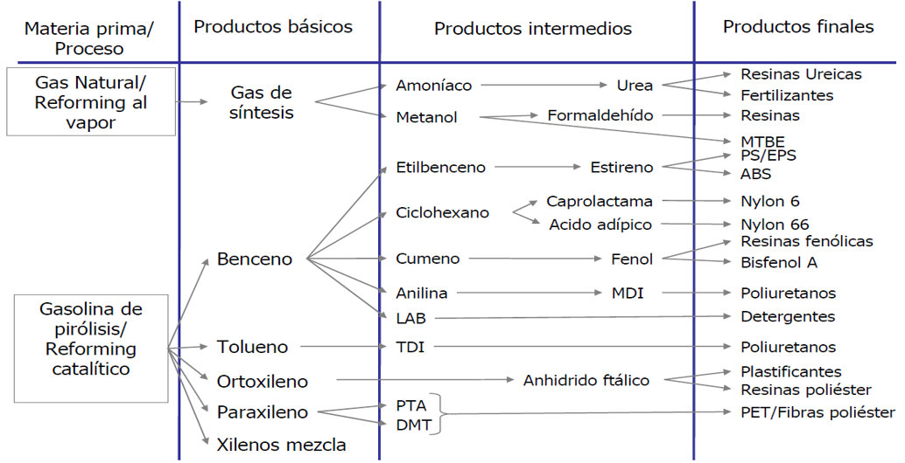
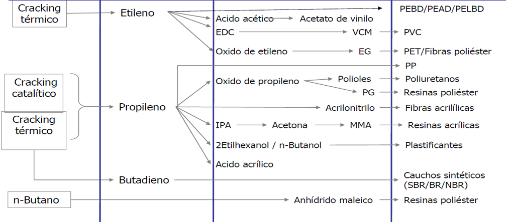
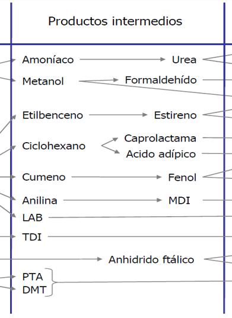
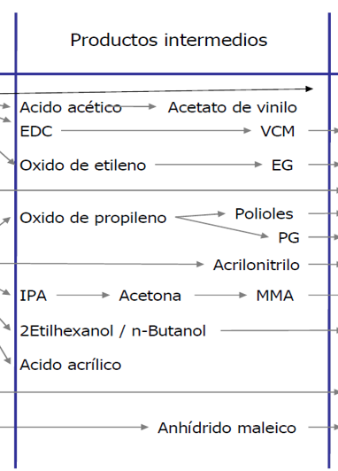

# Polímeros <!-- omit in toc -->

- [Árbol petroquímico](#árbol-petroquímico)
  - [Mnemotecnias](#mnemotecnias)
- [Clasificación de los polímeros según su respuesta termomecánica](#clasificación-de-los-polímeros-según-su-respuesta-termomecánica)
- [Preguntas teóricas](#preguntas-teóricas)
  - [Del profesor (parcial)](#del-profesor-parcial)
  - [Del profesor (final)](#del-profesor-final)
  - [De ChatGPT: fundamentos](#de-chatgpt-fundamentos)
  - [De ChatGPT: polímeros específicos](#de-chatgpt-polímeros-específicos)

---

## Árbol petroquímico
Esta tabla proporciona un resumen de varios polímeros, sus monómeros, las siglas por las que se les conoce y su clasificación general en términos de tipo de polímero. Cabe señalar que algunos polímeros pueden exhibir diferentes propiedades y, por lo tanto, ser clasificados en más de un tipo dependiendo de su procesamiento y aplicación específica.

### Mnemotecnias

| | | |
|---:|:---:|:---|
|  |  |  
 |  | 

"Amón Maquilla Elefantes Con Colores Alegres, Llenando Toda la Piel de Diversión"

"Urías Fabrica Estatuas, Creando Animales Fantásticos de Mármol Asombroso"

"Acacio Explora Orquídeas, Observando Insectos con 2 Encantadoras Alas"

"Acil Vuela Entre Paisajes Pintorescos, Atravesando Montañas Altas"

## Clasificación de los polímeros según su respuesta termomecánica

| **Polímero**                 | **Monómero**                        | **Sigla** | **Tipo de Polímero** |
|------------------------------|-------------------------------------|-----------|----------------------|
| Polietileno de alta densidad | Etileno                             | HDPE      | Termoplástico        |
| Polietileno de baja densidad | Etileno                             | LDPE      | Termoplástico        |
| Poliestireno                 | Estireno                            | PS        | Termoplástico        |
| Policarbonato                | Bisfenol A y fosgeno                | PC        | Termoplástico        |
| Poli(etileno tereftalato)    | Tereftalato de dimetilo y etilenglicol | PET    | Termoplástico        |
| Epoxi                        | Bisfenol A y epiclorhidrina         | EP        | Termoestable         |
| Caucho de butadieno          | Butadieno                           | PBR       | Elastómero           |
| Polibutadieno metacrilato    | Metacrilato de butilo y butadieno   | PBMA      | Termoplástico        |
| Polipropileno                | Propileno                           | PP        | Termoplástico        |
| Poli(cloruro de vinilo)      | Cloruro de vinilo                   | PVC       | Termoplástico        |
| Poli(tetrafluoroetileno)     | Tetrafluoroetileno                  | PTFE      | Termoplástico        |
| Poli(metil metacrilato)      | Metil metacrilato                   | PMMA      | Termoplástico        |
| Nylon 6                      | Caprolactama                        | PA6       | Termoplástico        |
| Nylon 66                     | Adiponitrilo y hexametilendiamina   | PA66      | Termoplástico        |
| Fenol-formaldehído           | Fenol y formaldehído                | PF        | Termoestable         |
| Poliuretano                  | Diisocianato y diol                 | PU        | Termoestable         |
| Caucho natural               | Isopreno                            | NR        | Elastómero           |
| Caucho de estireno-butadieno | Butadieno y estireno                | SBR       | Elastómero           |
| Silicona                     | Polidimetilsiloxano                 | PDMS      | Termoestable         |
| Poliuretanos termoplásticos  | Diisocianato y polioles             | TPU       | Elastómero           |
| Poliimida                    | Ácido pirobenzoico y diamina        | PI        | Termoestable         |
| Poliacrilonitrilo            | Acrilonitrilo                       | PAN       | Termoplástico        |
| Polisulfona                  | Bisfenol A y cloruro de difenilsulfona | PSU    | Termoplástico        |

## Preguntas teóricas

### Del profesor (parcial)

2. ¿Cuáles son las zonas presentes en un polímero termoplástico? Y explíca cuáles son los tipos de termperatura que se evalúan en ellas.

3. Explíca cómo se relacionan las propiedades mecánicas con la estructura interna de las cadenas.

4. Explica por qué el HDPE tiene mejores propiedades mecánicas que el LDPE.

5. Explica por qué el PVC tiene más valor en la temperatura de transición vítrea que el PP.

### Soluciones <!-- omit in toc -->

2. **Zonas presentes en un polímero termoplástico y tipos de temperatura evaluados:**

   Los polímeros termoplásticos típicamente exhiben dos zonas principales cuando se calientan, cada una asociada con un rango específico de temperatura:

   - **Zona Elástica o de Transición Vítrea (Tg):** Es el rango de temperatura en el que el polímero pasa de ser duro y vítreo a blando y elástico. La temperatura de transición vítrea (Tg) es una propiedad crítica que se evalúa en esta zona. Por debajo de la Tg, los movimientos de las cadenas poliméricas están congelados y el material es rígido. Por encima de la Tg, las cadenas pueden moverse más libremente, haciendo que el material se vuelva flexible y tenaz.

   - **Zona Viscosa o de Fusión (Tm):** En esta zona, a medida que la temperatura aumenta por encima de la Tg, el polímero se vuelve cada vez más viscoso hasta que alcanza la temperatura de fusión (Tm). La Tm es el punto en el cual el polímero pasa de un estado viscoso a un estado líquido. En este estado fundido, las cadenas poliméricas pueden deslizarse unas sobre otras, lo que permite el procesamiento del polímero mediante técnicas como la inyección de moldeo o el extrusionado.

   Además de la Tg y Tm, se pueden evaluar otras temperaturas, como la temperatura de descomposición, que es el punto en el cual el polímero comienza a descomponerse químicamente.

3. **Relación entre propiedades mecánicas y estructura interna de las cadenas:**

   Las propiedades mecánicas de los polímeros, como la elasticidad, la resistencia a la tracción y la dureza, están íntimamente relacionadas con la estructura interna de sus cadenas. Factores como la longitud de la cadena, el grado de entrelazado, la cristalinidad, la tacticidad y la presencia de enlaces cruzados afectan estas propiedades:

   - **Longitud de Cadena y Entrelazado:** Cadenas más largas y un mayor entrelazado entre ellas suelen aumentar la resistencia mecánica del polímero.
   - **Cristalinidad:** Los polímeros semi-cristalinos, donde las cadenas se organizan en regiones ordenadas, tienden a ser más fuertes y rígidos que los amorfos.
   - **Tacticidad:** La disposición espacial de los grupos laterales en la cadena (isotáctica, sindiotáctica, atáctica) influye en cómo las cadenas se empacan y deslizan entre sí, afectando las propiedades mecánicas.
   - **Enlaces Cruzados:** La presencia de enlaces covalentes entre las cadenas poliméricas (reticulación) puede aumentar significativamente la resistencia térmica y mecánica del material.

4. **Propiedades mecánicas del HDPE vs. LDPE:**

   El polietileno de alta densidad (HDPE) tiene mejores propiedades mecánicas que el polietileno de baja densidad (LDPE) debido a diferencias en su estructura molecular y grado de cristalinidad:

   - **Estructura Molecular:** HDPE tiene cadenas más lineales y menos ramificaciones que LDPE. Esto permite un empaquetamiento más estrecho de las cadenas, lo que resulta en un material más denso y cristalino.
   - **Grado de Cristalinidad:** HDPE es más cristalino que LDPE. La cristalinidad aumenta la resistencia a la tracción y la rigidez debido al mayor ordenamiento molecular.

5. **Temperatura de transición vítrea (Tg) del PVC vs. PP:**

   El cloruro de polivinilo (PVC) tiene una temperatura de transición vítrea más alta que el polipropileno (PP) principalmente debido a la presencia de cloro en su cadena molecular:

   - **Polaridad:** Los átomos de cloro en el PVC aumentan la polaridad del polímero, lo que resulta en una mayor atracción intermolecular entre las cadenas. Esto hace que sea más difícil para las cadenas moverse pastosamente y, por lo tanto, eleva la Tg.
   - **Rigidez de la Cadena:** El cloro también aumenta la rigidez de la cadena polimérica del PVC. Las cadenas más rígidas requieren más energía (mayor temperatura) para alcanzar la movilidad necesaria que caracteriza el estado caucho o elástico por encima de la Tg.

   Por otro lado, el PP, que es menos polar y tiene una estructura molecular más flexible, exhibe una Tg más baja, lo que le confiere mayor movilidad a las cadenas a temperaturas más bajas.

### Del profesor (final)

1. Explíca detalladamente los factores que favorecen la cristalinidad.
2. Explíca detalladamente el comportamiento mecánico de los siguientes polímeros:
    - a. Poliisobutileno (balndos y débiles)
    - b. Poliestireno (duros y frágiles)
    - c. PVC plastificado (blandos y tenaces)
    - d. Copolímeros ABS (duros y tenaces)
3. Explica detalladamente mediante una gráfica el comportamiento viscoelástico de los polímeros.
4. Explica detalladamente el mecanismo de reacción de polimerizaciòn para la producciòn de:
    - a. Polietileno
    - b. Poliisobutileno
    - c. Poliacrilonitrilo
5. Explica detalladamente la reacción de polimerización radicalaria (por radicales) controlada y polimerización en emulsión. 
6. En la siguiente tabla adjunta se recoge la distribución de pesos moleculares de una determinada muestra de un material polimérico. Sabiendo que su grado de polimerización, en peso, es 752. Determinar de cuál de los siguientes polímeros se trata: Polietileno, Poliestireno, (Policloruro de vinilo, Politetrafluoroetileno (Teflón)

    | Intervalo       | % en peso |
    |-----------------|-----------|
    | 15.000-25.000   | 5         |
    | 25.000-35.000   | 10        |
    | 35.000-45.000   | 15        |
    | 45.000-55.000   | 25        |
    | 55.000-65.000   | 20        |
    | 65.000-75.000   | 5         |

### Solución <!-- omit in toc -->

1. **Factores que favorecen la cristalinidad en polímeros:**
  La cristalinidad en los polímeros es un factor crucial que afecta sus propiedades físicas y químicas. Varios factores influyen en el grado de cristalinidad de un polímero, incluyendo la tacticidad, la polaridad molecular, la configuración, la presencia de plastificantes, las ramificaciones y el peso molecular. Aquí se explica detalladamente cómo cada uno de estos factores afecta la cristalinidad:
  
  1. **Tacticidad:**
     - La tacticidad se refiere a la disposición espacial regular de los grupos laterales en la cadena principal del polímero.
     - Los polímeros isotácticos, donde los grupos laterales están alineados uniformemente en un lado de la cadena polimérica, tienden a ser más cristalinos debido a su estructura regular que facilita un empaquetamiento ordenado.
     - Los polímeros sindiotácticos, con una disposición alternada de los grupos laterales, también pueden ser bastante cristalinos.
     - Los polímeros atácticos, con una disposición aleatoria de grupos laterales, suelen ser amorfos debido a su estructura irregular que impide el empaquetamiento ordenado.
  
  2. **Polaridad Molecular:**
     - La polaridad de un polímero afecta las interacciones intermoleculares. Los polímeros con unidades monoméricas más polares suelen tener fuerzas intermoleculares más fuertes, lo que puede favorecer la cristalización.
     - Sin embargo, una alta polaridad también puede resultar en un aumento de la rigidez y disminuir la movilidad de la cadena, lo que puede complicar el proceso de cristalización.
  
  3. **Configuración:**
     - La configuración se refiere a la disposición geométrica de los átomos en una cadena polimérica. Por ejemplo, la configuración cis/trans en polímeros como el polibutadieno afecta su cristalinidad.
     - Las configuraciones que permiten un empaquetamiento más regular y denso de las cadenas favorecen la cristalización.
  
  4. **Plastificantes:**
     - Los plastificantes son aditivos que se añaden a los polímeros para mejorar su flexibilidad y procesabilidad.
     - Generalmente, los plastificantes reducen la cristalinidad al incrementar la distancia entre las cadenas poliméricas y disminuir las interacciones intermoleculares. Esto aumenta la movilidad de la cadena y disminuye el empaquetamiento ordenado.
  
  5. **Ramificaciones:**
     - Las ramificaciones en las cadenas poliméricas pueden obstaculizar el empaquetamiento ordenado necesario para la formación de estructuras cristalinas.
     - Los polímeros lineales, sin ramificaciones o con ramificaciones cortas, suelen tener un grado de cristalinidad más alto en comparación con los polímeros altamente ramificados.
  
  6. **Peso Molecular:**
     - El peso molecular y su distribución pueden influir en la cristalinidad. 
     - Los polímeros de alto peso molecular pueden tener regiones más extensas de empaquetamiento ordenado, lo que favorece la cristalinidad. Sin embargo, un peso molecular extremadamente alto puede resultar en una disminución de la movilidad de la cadena, dificultando la cristalización.
     - Una distribución uniforme del peso molecular también tiende a favorecer la cristalinidad en comparación con una distribución amplia.
  
  En resumen, la cristalinidad en los polímeros es el resultado de un delicado equilibrio entre varios factores estructurales y de composición. La comprensión de estos factores es esencial para diseñar polímeros con propiedades específicas para aplicaciones deseadas.

2. **Comportamiento mecánico de polímeros específicos:**
   - a. **Poliisobutileno:** Es blando y débil debido a su baja cristalinidad y alta flexibilidad molecular. La flexibilidad se debe a las cadenas de isobutileno que permiten fácil movimiento, resultando en una baja resistencia mecánica y dureza.
   - b. **Poliestireno:** Es duro y frágil debido a su estructura molecular rígida y amorfa. Los anillos bencénicos en la cadena del poliestireno restringen el movimiento, aumentando la dureza pero disminuyendo la tenacidad.
   - c. **PVC plastificado:** El PVC por sí solo es duro y frágil, pero al plastificarse, se añaden plastificantes que se intercalan entre las cadenas poliméricas, aumentando la flexibilidad y la tenacidad. Esto se traduce en un material más blando y maleable.
   - d. **Copolímeros ABS:** Son duros y tenaces debido a la combinación de estireno (que aporta dureza) y butadieno (que aporta tenacidad). La presencia de acrilonitrilo mejora la resistencia química y térmica. La fase elastomérica de butadieno proporciona tenacidad, mientras que la matriz estirénica proporciona rigidez.

3. **Comportamiento viscoelático de los polímeros mediante gráficas:**
   - **Conceptos Básicos de Viscoelasticidad:**
      - **Viscosidad:** Es la resistencia de un material al flujo. En los polímeros, esta propiedad está relacionada con la capacidad del material para disipar energía a través de movimientos internos cuando se aplica una fuerza.
      - **Elasticidad:** Es la capacidad de un material para recuperar su forma original después de retirar una fuerza que causó una deformación. En términos de polímeros, se refiere a cómo las cadenas moleculares pueden estirarse y luego volver a su estado original.

   - **Factores que Afectan el Comportamiento Viscoelástico:**
      - **Temperatura:** A temperaturas bajas, muchos polímeros se comportan de manera más elástica. A medida que la temperatura aumenta, el comportamiento se vuelve más viscoso. La transición entre estos estados a menudo ocurre cerca de la temperatura de transición vítrea (Tg) del polímero.
      - **Tiempo y Frecuencia de la Aplicación de la Fuerza:** La respuesta viscoelástica también depende de la velocidad a la que se aplican y se retiran las fuerzas. A altas velocidades o frecuencias, el comportamiento puede ser más elástico, mientras que a bajas velocidades o frecuencias, puede ser más viscoso.
      - **Estructura Molecular:** La longitud de la cadena, el grado de entrelazamiento, la cristalinidad y la presencia de enlaces cruzados influyen en cómo las cadenas poliméricas pueden moverse y reorganizarse bajo estrés.

    - **Modelos de Comportamiento Viscoelástico:**
      - **Modelo de Maxwell:** Describe un comportamiento viscoelástico donde un elemento elástico y un elemento viscoso están en serie. Es útil para describir la relajación de esfuerzos en polímeros.
      - **Modelo de Kelvin-Voigt:** Combina un elemento elástico y un elemento viscoso en paralelo. Este modelo es adecuado para describir la respuesta inmediata a una carga constante, como la deformación retardada.
    - **Gráficas**
       1.  [**Gráfica de Esfuerzo vs. Deformación:**](https://eng.libretexts.org/Bookshelves/Materials_Science/TLP_Library_I/13%3A_Crystallinity_in_polymers/13.04%3A_Section_4-) Esta gráfica muestra la respuesta de un material a un esfuerzo aplicado, usualmente tensil, y es fundamental en el diseño de ingeniería para determinar el módulo elástico y el esfuerzo de fluencia de un material. En polímeros, estas curvas se producen estirando una muestra a una tasa constante mediante la aplicación de una fuerza de tensión. La curva exacta depende del tipo de polímero y puede variar en función de la temperatura.

       2. [**Gráfica de Módulo de Almacenamiento (E') y Módulo de Pérdida (E") vs. Temperatura:**](https://chem.libretexts.org/Bookshelves/Analytical_Chemistry/Physical_Methods_in_Chemistry_and_Nano_Science_(Barron)/02%3A_Physical_and_Thermal_Analysis/2.10%3A_Dynamic_Mechanical_Analysis) Estas gráficas muestran cómo, al aumentar la temperatura, un polímero atraviesa una serie de transiciones menores y una transición de vidrio notable, donde el módulo de almacenamiento (elástico) del polímero disminuye dramáticamente. El módulo de pérdida (E") muestra picos en la transición de vidrio, reflejando la transición de un comportamiento predominantemente elástico a uno viscoso. La temperatura de transición de vidrio se puede determinar usando el módulo de almacenamiento, el módulo complejo, o el tan δ (vs temperatura).

       3. [**Gráfica de Relajación de Esfuerzo:**](https://eng.libretexts.org/Bookshelves/Mechanical_Engineering/Mechanics_of_Materials_(Roylance)/05%3A_General_Stress_Analysis/5.04%3A_Linear_Viscoelasticity) En pruebas de relajación de esfuerzo, se monitorea el esfuerzo dependiente del tiempo resultante de una deformación constante. Estas curvas pueden superponerse mediante el "módulo de relajación", que se define como $E_{rel}(t) = \sigma (t)/\epsilon_0$ y se representa gráficamente contra el tiempo logarítmico. En tiempos cortos, el esfuerzo está en un alto plateau correspondiente a un módulo "vidrioso", y luego cae exponencialmente a un módulo de equilibrio "gumoso" más bajo.

       4. [**Gráfica de Creep (Fluencia):**](https://eng.libretexts.org/Bookshelves/Mechanical_Engineering/Mechanics_of_Materials_(Roylance)/05%3A_General_Stress_Analysis/5.04%3A_Linear_Viscoelasticity) El ensayo de creep consiste en medir la deformación dependiente del tiempo resultante de la aplicación de un esfuerzo uniaxial constante. Si el material responde de manera lineal, la relación esfuerzo-deformación es proporcional. La "compliance" de creep, $C_{crp} (t) = \dfrac{\epsilon (t)}{\sigma_0}$, se muestra en una gráfica típica contra el tiempo logarítmico, donde el material se deforma inicialmente a la "compliance" vidriosa, seguida de un aumento hacia un valor de equilibrio o "gumoso".
  
       5. [**Gráfica de Módulo de Almacenamiento y Pérdida vs. Frecuencia:**](https://ebrary.net/196082/health/storage_modulus_loss_modulus_frequency) En esta gráfica, tanto el módulo de almacenamiento (G') como el de pérdida (G") se representan en función de la frecuencia para diferentes temperaturas. Se observa que tanto G' como G" aumentan con el aumento de la frecuencia y disminuyen con el aumento de la temperatura. A bajas frecuencias, el módulo de almacenamiento es menor que el módulo de pérdida, lo que indica que las propiedades viscosas del material dominan sobre las elásticas. A medida que la frecuencia aumenta, el módulo de almacenamiento aumenta, lo que indica que el material tiene la capacidad de almacenar más energía. Este comportamiento varía con la arquitectura molecular del polímero y su distribución de peso molecular, con polímeros de alto peso molecular mostrando un cambio de comportamiento viscoso a elástico a frecuencias más bajas en comparación con polímeros de bajo peso molecular.

4. **Mecanismo de reacción de polimerización para la producción de polímeros:**
   - a. **Polietileno:** Se puede producir mediante polimerización radicalaria (alta presión, baja densidad) o por catalizadores de Ziegler-Natta o metalloceno (baja presión, alta densidad). En ambos casos, el monómero de etileno se abre y forma radicales libres o centros activos que se enlazan sucesivamente para formar cadenas largas.
   - b. **Poliisobutileno:** Se produce mediante polimerización radicalaria, iniciada por radicales libres. El monómero isobutileno se activa formando radicales que se unen para formar cadenas poliméricas.
   - c. **Poliacrilonitrilo:** Se sintetiza generalmente mediante polimerización radicalaria en solución, donde el monómero acrilonitrilo es polimerizado en presencia de un iniciador de radicales libres.

5. **Polimerización radicalaria controlada y polimerización en emulsión:**
   - **Polimerización radicalaria controlada:** Se refiere a técnicas que permiten un control preciso sobre la arquitectura molecular de los polímeros, como la longitud de la cadena y la distribución del peso molecular. Esto se logra mediante el uso de agentes controladores o "transferentes de cadena" que regulan el crecimiento de la cadena polimérica. Técnicas como la polimerización por transferencia de cadena reversible (RAFT) y la polimerización por transferencia de átomo (ATRP) son ejemplos de polimerización radicalaria controlada.
   - **Polimerización en emulsión:** Es un proceso en el cual el monómero se polimeriza dentro de micelas en una emulsión acuosa. Utiliza un iniciador

6. **Determina el polímero basado en la tabla de datos**
   
    Para determinar de qué polímero se trata en esta muestra, necesitamos usar el grado de polimerización dado (752) y la distribución de pesos moleculares para calcular la masa molar del monómero. El grado de polimerización (GP) es el número promedio de unidades monoméricas en una cadena de polímero. Se calcula como:

    $\text{GP} = \frac{\text{Peso molecular promedio del polímero}}{\text{Peso molecular del monómero}}$

    Primero, calcularemos el peso molecular promedio del polímero a partir de la distribución dada. Luego, usaremos el grado de polimerización para encontrar la masa molar del monómero. Finalmente, compararemos este valor con las masas molares conocidas de los monómeros de los polímeros mencionados (Polietileno, Poliestireno, Policloruro de vinilo, Politetrafluoroetileno) para identificar de cuál se trata.

    Las masas molares de los monómeros son aproximadamente:
    - Polietileno (C2H4): 28 g/mol
    - Poliestireno (C8H8): 104 g/mol
    - Policloruro de vinilo (PVC, C2H3Cl): 62.5 g/mol
    - Politetrafluoroetileno (PTFE, Teflón, C2F4): 100 g/mol

    Calculemos el peso molecular promedio del polímero utilizando la distribución de pesos moleculares proporcionada.

    El peso molecular promedio del polímero calculado es de 38,000 g/mol. Ahora, usaremos este valor y el grado de polimerización dado (752) para calcular la masa molar del monómero:

    $\text{Masa molar del monómero} = \frac{\text{Peso molecular promedio del polímero}}{\text{GP}}$

    Calculemos la masa molar del monómero.

    La masa molar del monómero calculada es aproximadamente 50.53 g/mol. Comparando este valor con las masas molares conocidas de los monómeros de los polímeros mencionados:

    - Polietileno (C2H4): 28 g/mol
    - Poliestireno (C8H8): 104 g/mol
    - Policloruro de vinilo (PVC, C2H3Cl): 62.5 g/mol
    - Politetrafluoroetileno (PTFE, Teflón, C2F4): 100 g/mol

    El valor más cercano a 50.53 g/mol es el del Policloruro de vinilo (PVC), cuya masa molar del monómero es aproximadamente 62.5 g/mol. Aunque no es una coincidencia exacta, es el más cercano entre las opciones dadas. Por lo tanto, es probable que la muestra sea de Policloruro de vinilo (PVC).

    **Explicación de los cálculos**

    - **Cálculo del Peso Molecular Promedio del Polímero:**
        - Primero, establecí una distribución de pesos moleculares con sus respectivos porcentajes en peso. La distribución se proporcionó en la tabla, con intervalos de peso molecular y sus correspondientes porcentajes.
        - Luego, calculé el promedio de cada intervalo de peso molecular. Esto se hace sumando el límite inferior y superior de cada intervalo y dividiéndolo entre dos.
        - Multipliqué este promedio por el porcentaje en peso para cada intervalo.
        - Finalmente, sumé todos estos valores y dividí por 100 para obtener el peso molecular promedio del polímero. Esto se debe a que los porcentajes deben sumar 100%, y la división ajusta el total acumulado al promedio ponderado.

    - **Cálculo de la Masa Molar del Monómero:**
        - Utilicé el valor del grado de polimerización proporcionado, que es 752.
        - Apliqué la fórmula del grado de polimerización, que relaciona el peso molecular promedio del polímero con la masa molar del monómero: \[ \text{Masa molar del monómero} = \frac{\text{Peso molecular promedio del polímero}}{\text{GP}} \]
        - Dividí el peso molecular promedio del polímero (38,000 g/mol) entre el grado de polimerización (752) para obtener la masa molar del monómero.

        Estos cálculos me permitieron estimar la masa molar del monómero, que luego comparé con las masas molares conocidas de los monómeros de los polímeros candidatos para identificar el polímero de la muestra. 

### De ChatGPT: fundamentos

Estas preguntas profundizan en el conocimiento teórico y aplicado de la petroquímica y los polímeros. Abarcan desde la química fundamental hasta aplicaciones industriales y consideraciones ambientales.

1. ¿Cómo afecta la configuración molecular (cabeza-cabeza, cabeza-cola) de los monómeros en un copolímero a las propiedades del polímero final?
   
2. ¿Qué rol juegan los catalizadores en la polimerización por adición y cómo pueden influir en la cinética de la reacción?

3. Explique la diferencia entre la degradación térmica y la fotodegradación de los polímeros y dé ejemplos de estabilizadores utilizados para prevenir cada tipo de degradación.

4. Describa el proceso de vulcanización del caucho y cómo afecta las propiedades físicas del material.

5. Compare y contraste los procesos de polimerización en emulsión, suspensión, solución y masa, y discuta las ventajas y desventajas de cada uno.

6. ¿Qué son los plásticos biodegradables y cómo se sintetizan? Proporcione ejemplos de polímeros biodegradables y sus aplicaciones.

7. Discuta cómo el peso molecular promedio y la distribución del peso molecular afectan las propiedades de procesamiento de los polímeros.

8. Explique qué es la permeabilidad en los polímeros y cómo las características estructurales del polímero afectan su permeabilidad a gases y líquidos.

9. Analice el concepto de reciclabilidad de los polímeros y los retos asociados al reciclaje de los termoestables y elastómeros.

10. ¿Cómo afectan los copolímeros de bloque y los copolímeros en injerto a las propiedades mecánicas y térmicas de los materiales poliméricos? Dé ejemplos de aplicaciones donde estos materiales son preferidos.

### Soluciones <!-- omit in toc -->

1. **Configuración molecular en copolímeros:**
   La configuración molecular de los monómeros en copolímeros (cabeza-cabeza, cabeza-cola) afecta significativamente las propiedades físicas y químicas del polímero. En una configuración cabeza-cola, los monómeros se alinean de manera que el final de un monómero se une al inicio del siguiente, lo que conduce a una estructura más ordenada y regular, mejorando la cristalinidad y, por ende, las propiedades mecánicas y térmicas. En cambio, una disposición cabeza-cabeza puede resultar en una estructura más desordenada y amorfos con propiedades diferentes, como menor punto de fusión y resistencia mecánica.

2. **Rol de los catalizadores en la polimerización por adición:**
   Los catalizadores juegan un papel crucial en la polimerización por adición, afectando la velocidad y el control de la reacción. Pueden aumentar la velocidad de la polimerización, permitir condiciones de reacción más suaves, y ayudar a controlar la estructura molecular del polímero, como la longitud de la cadena y la distribución del peso molecular. Los catalizadores también pueden influir en la estereoquímica de la polimerización, afectando la tacticidad del polímero.

3. **Diferencia entre degradación térmica y fotodegradación:**
   La degradación térmica ocurre cuando los polímeros se descomponen debido al calor, provocando la ruptura de los enlaces químicos. La fotodegradación, en cambio, es causada por la exposición a la luz, especialmente a la radiación UV, que también rompe los enlaces químicos. Para prevenir la degradación térmica, se utilizan estabilizadores como los antioxidantes. Para la fotodegradación, se emplean absorbentes UV o estabilizadores HALS (estabilizadores de luz de amina impedida).

4. **Proceso de vulcanización del caucho:**
   La vulcanización es un proceso químico donde el caucho se mezcla con azufre y se calienta para formar enlaces cruzados entre las cadenas de polímeros. Esto mejora significativamente las propiedades físicas del caucho, como su elasticidad, resistencia a la temperatura, durabilidad y resistencia a los solventes.

5. **Polimerización en emulsión, suspensión, solución y masa:**
   - **Emulsión:** Se realiza en agua con la presencia de un emulsionante. Ventajas incluyen una alta velocidad de reacción y control de tamaño de partícula. Desventaja: purificación del polímero puede ser difícil.
   - **Suspensión:** Similar a la emulsión pero sin emulsionante, formando perlas de polímero. Ventaja: facilita la separación y purificación. Desventaja: control de tamaño de partícula es más difícil.
   - **Solución:** El monómero se disuelve en un solvente. Ventaja: buen control de la estructura molecular. Desventaja: requiere la eliminación del solvente.
   - **Masa:** Directamente a partir del monómero sin solventes. Ventaja: pureza del polímero. Desventaja: control de la reacción puede ser más difícil.

6. **Plásticos biodegradables:**
   Los plásticos biodegradables se descomponen naturalmente por acción microbiana. Se sintetizan a partir de fuentes renovables como el almidón, el ácido poliláctico (PLA) o polihidroxialcanoatos (PHA). Se utilizan en aplicaciones como envases, bolsas de compras y materiales agrícolas.

7. **Peso molecular promedio y distribución en polímeros:**
   El peso molecular y su distribución afectan propiedades como la viscosidad de fusión, la resistencia mecánica, la tenacidad y la procesabilidad. Un alto peso molecular generalmente mejora las propiedades mecánicas pero puede complicar el procesamiento debido a la alta viscosidad.

8. **Permeabilidad en polímeros:**
   La permeabilidad es la capacidad de un polímero para permitir que gases o líquidos lo atraviesen. Factores como la cristalinidad, la polaridad, y la presencia de grupos funcionales afectan

 la permeabilidad. Los polímeros más cristalinos y con mayor interacción intermolecular suelen ser menos permeables.

9. **Reciclabilidad de polímeros termoestables y elastómeros:**
   La reciclabilidad de los termoestables y elastómeros es desafiante debido a su estructura de red tridimensional fuertemente reticulada, que no se puede fundir y reformar. Esto limita su reciclaje a métodos mecánicos o químicos menos eficientes.

10. **Copolímeros de bloque y en injerto en propiedades mecánicas y térmicas:**
   Los copolímeros de bloque y en injerto ofrecen una combinación única de propiedades, como resistencia al impacto y estabilidad térmica. Los bloques proporcionan dominios con propiedades específicas (como dureza y flexibilidad), mientras que los injertos pueden mejorar la compatibilidad entre fases distintas. Se usan en aplicaciones como materiales de alto impacto, adhesivos y compatibilizantes en mezclas de polímeros.

### De ChatGPT: polímeros específicos

Estas preguntas buscan profundizar en varios aspectos de los polímeros: propiedades físicas y químicas, síntesis y procesamiento, y aplicaciones y desafíos de reciclaje.

1. ¿Por qué el HDPE es más adecuado para aplicaciones que requieren resistencia química y a la tracción, como en la fabricación de contenedores para leche, en comparación con el LDPE?

2. Compare la resistencia al impacto del poliestireno (PS) con la del policarbonato (PC) y explique por qué el PC es preferido para aplicaciones como visores de cascos de seguridad.

3. ¿Cómo influye la cristalinidad del PET en sus propiedades de barrera y cómo afecta esto su uso en la industria del envasado de alimentos y bebidas?

4. Explique cómo la estructura química del poli(butil metacrilato) (PBMA) afecta su compatibilidad con el polibutadieno en la síntesis de copolímeros de alto impacto.

5. ¿Cuál es la importancia de la reticulación en las resinas epoxi (EP) y cómo se controla el proceso de curado para obtener diferentes propiedades finales?

6. ¿Por qué el PBR (caucho de polibutadieno) es frecuentemente utilizado en la fabricación de neumáticos y cuáles son sus ventajas sobre otros elastómeros en esta aplicación?

7. Discuta las diferencias en la resistencia a la temperatura y la estabilidad UV entre el HDPE y el LDPE y cómo estas propiedades determinan sus aplicaciones específicas.

8. ¿Cómo afecta la inclusión de aditivos retardantes de llama en la formulación del PC a sus propiedades ópticas y mecánicas?

9. En términos de reciclabilidad, ¿cómo se comparan el PS y el PET, y qué retos presenta cada uno en el proceso de reciclaje?

10. Considerando que el LDPE tiene una resistencia térmica más baja que el HDPE, ¿cómo afecta esto su procesamiento y qué técnicas se pueden utilizar para mejorar su estabilidad térmica durante el moldeo?

### Soluciones <!-- omit in toc -->

Por supuesto, aquí tienes las respuestas a las preguntas formuladas con rigor científico:

1. **Resistencia química y a la tracción del HDPE vs. LDPE:**
   HDPE posee una mayor resistencia química y tensil que LDPE debido a su alta cristalinidad y estructura lineal, que permite un empaquetamiento más denso de las cadenas poliméricas. Esto se traduce en una mayor densidad y fuerzas intermoleculares más fuertes, resultando en una mejor resistencia a productos químicos y a la tensión mecánica, lo cual es crucial para contenedores que almacenan líquidos como la leche.

2. **Resistencia al impacto del PS vs. PC:**
   El policarbonato es notablemente más resistente al impacto que el poliestireno debido a su estructura molecular que incluye grupos bisfenol A unidos por grupos carbonato, lo que le confiere una combinación de rigidez y ductilidad. Esto hace al PC ideal para aplicaciones de seguridad donde se requiere claridad óptica y una alta resistencia al impacto, como en visores de cascos.

3. **Cristalinidad del PET y sus propiedades de barrera:**
   La cristalinidad del PET impacta directamente en sus propiedades de barrera, particularmente a los gases. Una alta cristalinidad reduce la permeabilidad a gases como el oxígeno y el dióxido de carbono, lo cual es beneficioso para envases de bebidas carbonatadas y alimentos, manteniendo la frescura y la efervescencia.

4. **Estructura química del PBMA y su compatibilidad con el polibutadieno:**
   PBMA tiene grupos metacrilato de butilo que pueden interactuar favorablemente con el polibutadieno mediante interacciones secundarias como fuerzas de Van der Waals. Esto es clave en la producción de copolímeros de alto impacto, ya que la compatibilidad entre estos componentes permite una mejor dispersión de las fases, mejorando las propiedades mecánicas del copolímero.

5. **Importancia de la reticulación en las resinas epoxi:**
   La reticulación en resinas epoxi es crucial para determinar la rigidez, resistencia química, y estabilidad térmica del material curado. El proceso de curado se controla variando la cantidad y el tipo de agente de curado (endurecedor), la temperatura, y el tiempo, permitiendo la personalización de las propiedades finales de las resinas para aplicaciones específicas.

6. **Uso del PBR en la fabricación de neumáticos:**
   El PBR es preferido en la fabricación de neumáticos debido a su buena resistencia a la abrasión, baja generación de calor durante el funcionamiento y mejor agarre, especialmente en superficies mojadas. Estas propiedades se derivan de su estructura molecular que permite una buena elasticidad y capacidad de deformación sin ruptura.

7. **Diferencias en resistencia a la temperatura y estabilidad UV entre HDPE y LDPE:**
   HDPE tiene una mayor resistencia a la temperatura y estabilidad UV que LDPE. La alta cristalinidad y la menor ramificación del HDPE le confieren una mayor estabilidad térmica, lo que le permite soportar temperaturas más altas sin deformarse. La estabilidad UV puede ser mejorada en ambos polímeros a través de la adición de estabilizadores UV durante el procesamiento.

8. **Impacto de los aditivos retardantes de llama en el PC:**
   La incorporación de aditivos retardantes de llama en el PC puede influir en sus propiedades mecánicas y ópticas. Aunque mejoran la resistencia a la ignición y propagación de llama, pueden afectar la transparencia y la resistencia al impacto del PC. Por tanto, se debe lograr un equilibrio entre la retardancia de llama y las propiedades ópticas/mecánicas deseadas.

9. **Reciclabilidad del PS y PET:**
   El PET es uno de los plásticos más reciclados debido a su alta cristalinidad y estabilidad térmica, que permiten su reprocesamiento sin degradar significativamente sus propiedades. El PS, aunque técnicamente reciclable, a menudo no se recicla debido a su baja densidad y alto volumen, que hacen que el transporte no sea rentable. Además, el PS puede liberar estireno, un monómero que puede ser perjudicial, durante el reciclaje si no se maneja adecuadamente. El reciclaje del PET es más favorable debido a sistemas de recolección establecidos y un mercado fuerte para los materiales reciclados, como las fibras de poliéster y nuevas botellas de PET.

10. **Mejora de la estabilidad térmica del LDPE durante el moldeo:**
   La estabilidad térmica del LDPE durante el procesamiento se puede mejorar mediante la adición de antioxidantes y estabilizadores de calor, que inhiben la oxidación y la degradación del polímero a altas temperaturas. Además, se pueden emplear técnicas de procesamiento avanzadas, como el control preciso de la temperatura y la tasa de enfriamiento, para minimizar la degradación térmica durante el moldeo. Estas técnicas permiten que el LDPE se procese a temperaturas más altas con menos riesgo de degradación, lo que es beneficioso para mejorar las propiedades del producto final y su rendimiento durante la fabricación.
